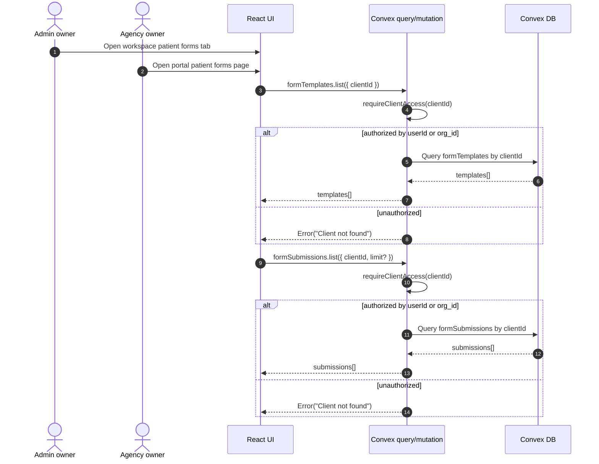
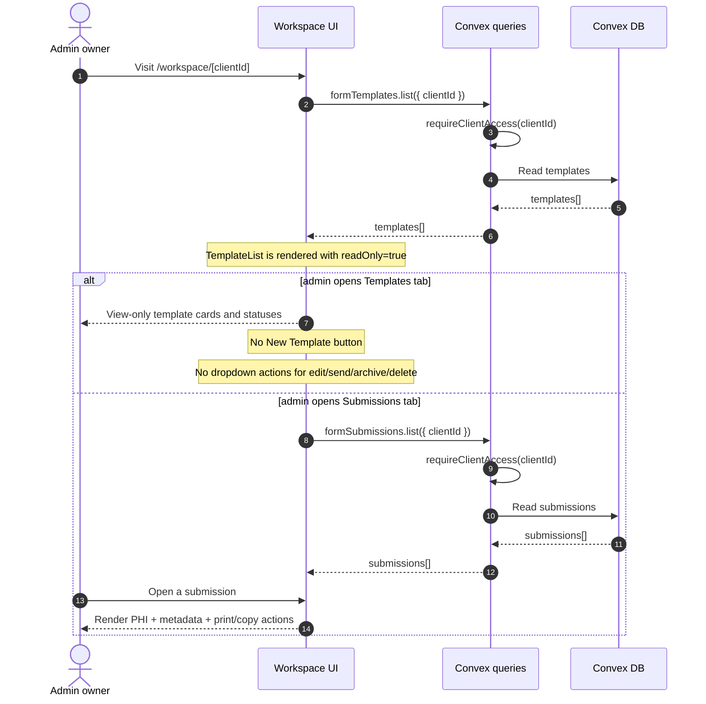
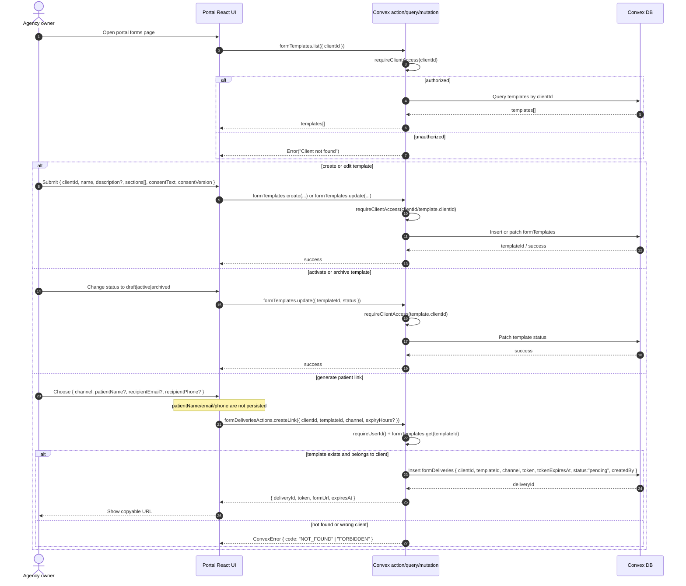
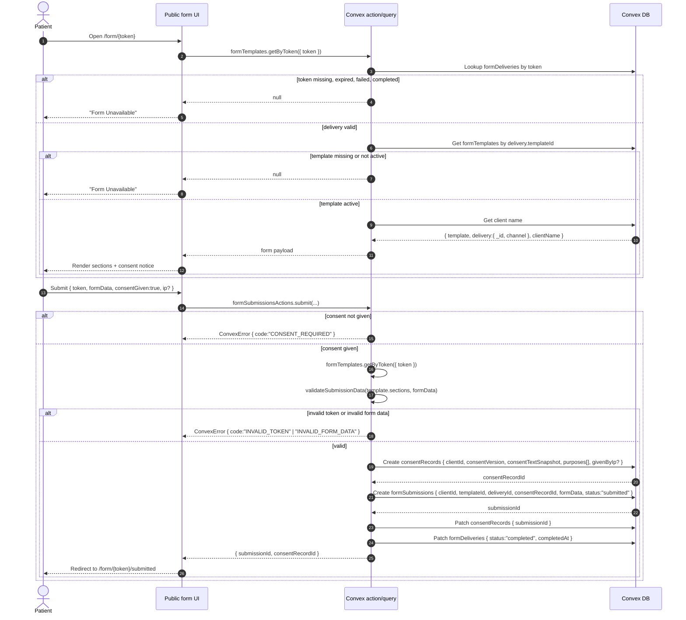

# Patient Forms

This document describes the current implemented state of patient forms across the admin workspace, the agency/client portal, and the public patient form link.

## Roles and Access

- `Admin owner`: the internal owner tied to `client.userId`.
- `Agency owner`: any authenticated portal user whose Clerk `org_id` matches `client.clerkOrganizationId`.
- `Patient`: unauthenticated public user holding a valid delivery token.

Both admin owners and agency owners pass the same Convex access guard in `requireClientAccess`, so the backend data boundary is shared even though the frontend capability surface is different.

### Relevant Files

- `convex/_lib/auth.ts`: shared access guard that authorizes both admin owners and agency owners.
- `convex/formTemplates.ts`: template listing query and token-based public template lookup.
- `convex/formSubmissions.ts`: submission listing query used by both internal role views.
- `app/(admin-dashboard)/workspace/[clientId]/page.tsx`: admin workspace entry that loads the client context.
- `app/(client-portal)/portal/layout.tsx`: portal layout that resolves the tenant and injects the client context.
- `components/portal/portal-client-provider.tsx`: provides `clientId` to portal forms pages.

## Admin Owner View

Current UI behavior:

- Admin owner reaches patient forms inside the workspace tabs.
- The workspace patient forms tab passes `readOnly` to `TemplateList`, so template creation, editing, activation, archiving, deletion, and link generation are hidden in this surface.
- Admin owner can still open and inspect submissions because submissions are not read-only in the UI.
- Backend does not distinguish admin vs agency for write permission, so this is a frontend restriction only.

### Relevant Files

- `app/(admin-dashboard)/workspace/[clientId]/page.tsx`: admin workspace route that loads the client and mounts the workspace UI.
- `components/workspace/workspace-tabs.tsx`: enables the `patient_forms` module tab inside the admin workspace.
- `components/workspace/patient-forms-tab.tsx`: admin patient forms tab that passes `readOnly` to the template list and loads submissions.
- `components/dental-forms/template-list.tsx`: shared template UI where `readOnly` removes create/edit/send/delete actions.
- `components/dental-forms/submissions-list.tsx`: shared submissions list used by admin and agency views.
- `components/dental-forms/submission-detail.tsx`: detailed PHI view with print/copy actions for a selected submission.
- `convex/formTemplates.ts`: shared template list/get/create/update/remove handlers, even though admin UI hides write actions.
- `convex/formSubmissions.ts`: shared submission list/get handlers used by the admin view.

## Agency Owner View

Current UI behavior:

- Agency owner reaches patient forms through the tenant portal.
- This surface uses the same `TemplateList` component without `readOnly`, so agency owners can create templates, edit them, change status, delete them, and generate patient links.
- Submissions are viewable here as well.
- Email/SMS/QR are not actually delivered yet; the action generates a secure URL and the UI asks the user to copy/send it manually for email/SMS.

### Relevant Files

- `app/(client-portal)/portal/layout.tsx`: tenant portal layout that resolves the organization-scoped client.
- `app/(client-portal)/portal/forms/page.tsx`: portal forms page that loads templates and submissions.
- `components/portal/portal-client-provider.tsx`: provides `clientId` to the portal forms page.
- `components/dental-forms/template-list.tsx`: exposes create, edit, status, delete, and send actions when `readOnly` is omitted.
- `components/dental-forms/template-editor.tsx`: form template editor used for create and update flows.
- `components/dental-forms/delivery-dialog.tsx`: link generation UI for active templates.
- `convex/formTemplates.ts`: backend handlers for template list/create/update/remove and public token lookup.
- `convex/formDeliveriesActions.ts`: action that creates tokenized delivery links and returns the public form URL.
- `convex/formDeliveries.ts`: internal delivery insert/status mutation helpers.
- `convex/_lib/auth.ts`: shared `requireClientAccess` and `requireUserId` checks involved in portal access and link creation.

## Patient Submission Flow

Current UI behavior:

- Patient accesses `/form/[token]` without Clerk auth.
- Token lookup only succeeds when delivery exists, is unexpired, is not `completed|expired|failed`, and the template is `active`.
- On submit, form data is validated against template sections, consent is required, a consent record is created, then the submission is stored and the delivery is marked `completed`.

### Relevant Files

- `app/(patient-form)/form/[token]/page.tsx`: public token route that loads form data and handles unavailable links.
- `app/(patient-form)/form/[token]/layout.tsx`: public patient form layout wrapper.
- `components/patient-form/form-renderer.tsx`: client form UI, local validation, consent state, and submit action call.
- `components/patient-form/consent-notice.tsx`: consent presentation and confirmation UI shown before submit.
- `components/patient-form/signature-pad.tsx`: signature capture used by signature fields in the form.
- `convex/formTemplates.ts`: token lookup query that validates delivery state and active template status.
- `convex/formSubmissionsActions.ts`: submit action that validates payloads and calls the internal submission mutation.
- `convex/formSubmissions.ts`: internal submission + consent creation flow and delivery completion update.
- `convex/consents.ts`: consent lookup query for submission-linked consent records.
- `lib/validation/dental-form.ts`: submission data validation logic used before persistence.

## Current State Summary

- Shared backend authorization: admin owners and agency owners both pass `requireClientAccess`.
- Frontend capability split: agency portal is full CRUD for templates; admin workspace is currently read-only for templates.
- Shared submission visibility: both roles can list and inspect submissions.
- Submission management gap: there is an internal `updateStatus` mutation for submissions, but there is no current UI wiring to review/approve/export/update status.
- Delivery gap: `createLink` creates a tokenized delivery record and returns a URL, but does not send email or SMS.
- Delivery tracking gap: delivery records start as `pending`, and there is no current UI path shown here for `sent`, `delivered`, or `opened` transitions.
- Consent capture is implemented: consent version and consent text snapshot are stored with each submission-linked consent record.
